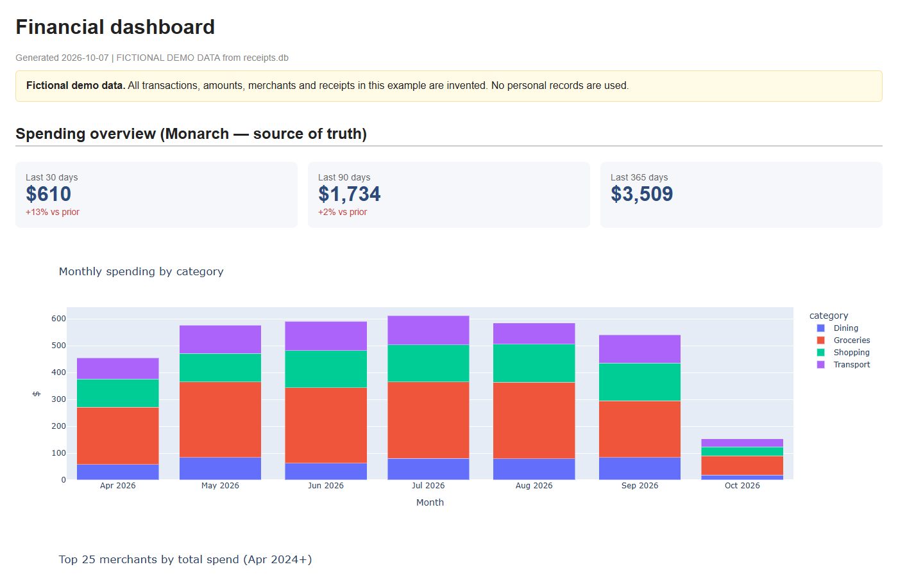

# finance-receipts-pipeline

Techniques and working code for building a personal finance cross-check from three sources you already have: **email receipts** (Gmail Takeout mbox), **bank/card statements** (PDF), and a **budgeting app export** (Monarch Money CSVs). The end product is a local SQLite database that matches receipts to real transactions, plus a static HTML dashboard.

Everything runs locally. No cloud services beyond optional LLM calls for the hard cases.

## The pipeline (receipts_pipeline/)

Five numbered stages, each a standalone script, documented end-to-end in [RUNBOOK.md](receipts_pipeline/RUNBOOK.md):

1. `01_parse_mbox.py` — parse a Gmail Takeout mbox of receipt emails into per-message body files + metadata rows
2. `02_extract_amounts.py` (+ `02b_cleanup_extractions.py`) — pull totals out of receipt bodies: rule-based extractors first, template extractors per merchant, then an LLM fallback (`extractors/llm_fallback.py`, batched `claude -p` calls) for the stragglers
3. `03_load_reference.py` — load budgeting-app transaction exports as the ground-truth ledger
4. `04_build_matches.py` — fuzzy-match receipts to transactions (amount + date-window + merchant similarity)
5. `05_build_dashboard.py` — generate a static HTML dashboard of matches, misses, and spend patterns

The interesting reusable tricks: the extractor cascade (cheap rules → merchant templates → batched LLM only for what escapes), and the match logic that tolerates amount drift (tips, FX) and date lag (settlement vs receipt date).

## Statement conversion (csvconv/)

PDF bank statements → budgeting-app import CSV, in two flavors:

- `process_bank.py` — fully local via [Ollama](https://ollama.com)
- `process_bank_claude.py` — via the Claude Code CLI (`CLAUDE_CLI` env var overrides the binary path)

Drop PDFs in `csvconv/process_pdf_here/`, run, get a combined transactions CSV (Monarch's upload format: `Date, Merchant Name, Data Provider Description, Amount, Category, Account, Tags, Notes`). Category back-fill: write a small rules script mapping your own merchant patterns to categories (the original is personal by construction and does not ship).

## Extras

- `refresh_monarch_live.py` — pull fresh transactions via the [monarch-mcp-server](https://github.com/robcerda/monarch-mcp-server) session instead of waiting for manual CSV exports (writes to a subfolder so the audited CSV-only pipeline never silently ingests it)

## Bring your own data

The repo ships code only. Point it at your own Gmail Takeout, statement PDFs, and app exports; all outputs (`*.db`, `bodies/`, dashboards, CSVs) are gitignored so your data can't end up in a commit.

## License

MIT. See [LICENSE](LICENSE).
